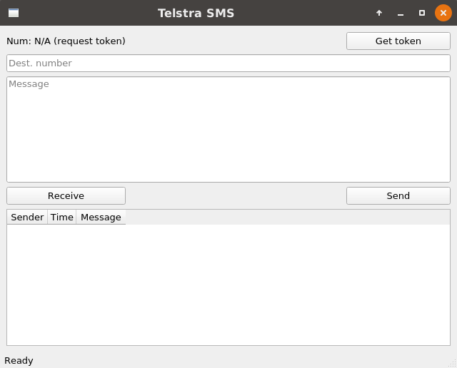

# Telstra Messaging Qt App

A little app to send and receive messages using the [Telstra Messaging API](https://www.telstra.com.au/business-enterprise/solutions/mobility-solutions/mobile-messaging/messaging-api) (Australia).



## Downloads (standalone)
Linux: [telstrasmsqt](dist/telstrasmsqt)

Windows: [telstrasmsqt.exe](dist/telstrasmsqt.exe) NOT AVAILABLE need to run `pyinstaller --onefile telstrasmsqt.py` on a Windows machine

## Dependencies
(if not using standalone packages)
- PyQt5
- requests

## Usage
1. Make an account on the [dev portal](https://dev.telstra.com/). 
2. Create a free trial app, and copy the key and secret.
3. Edit the file `app.conf.example`,  input your key(s) and secret(s), then rename it to `app.conf`:
```
[keys]
key1_here secret1_here
key2_here secret2_here
...
```
4. Run the app: `python3 telstrasmsqt.py` or `./telstrasmsqt` or double-click if using pre-built package.

## Other
Please report bugs or feature requests via Github issues. Contributions are welcome.